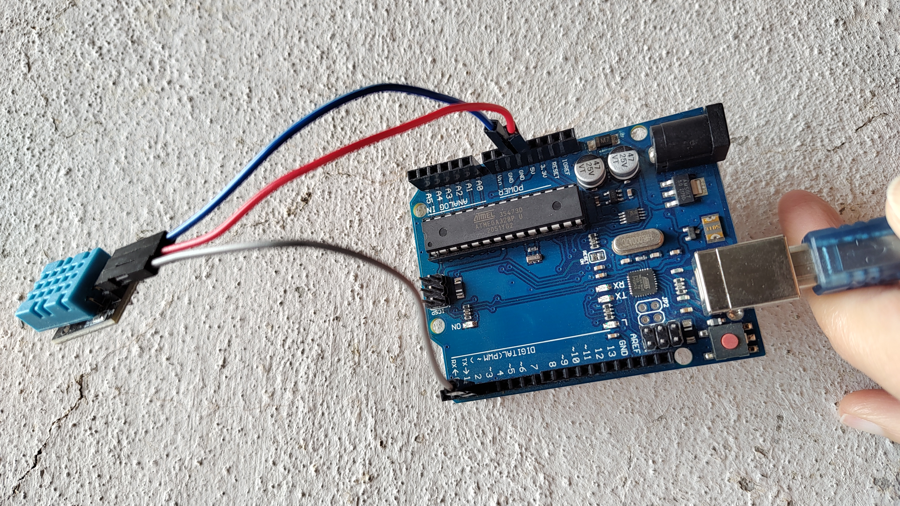
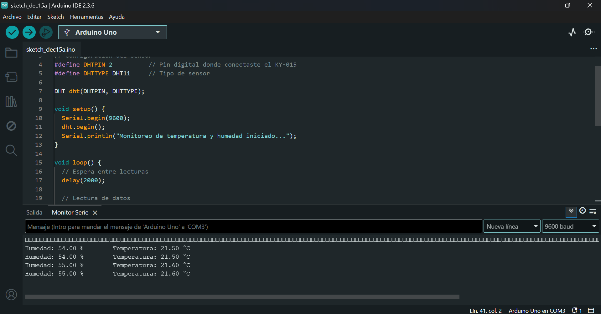

# Protocol for DHT11 Humidity Sensor

## 🎯 Objective
Monitor humidity and temperature to ensure proper storage of 3D printing filaments and maintain stable printing conditions.

## 🔧 Hardware Setup
1. Connect the KY-015 (DHT11) module to Arduino:
   - VCC → 5V
   - GND → GND
   - DATA → Digital pin 2
2. Verify connections are secure to avoid false readings.

## Hardware Setup

## 💻 Software Setup
1. Install the **Arduino IDE**.  
2. Add the **DHT library** via the Arduino Library Manager.  
3. Upload the sketch `humidity_dht11.ino` to your Arduino board.  
4. Open the Serial Monitor at **9600 baud**.

After uploading the sketch, open the Serial Monitor at **9600 baud**.  
You should see humidity and temperature readings like this:

## 📊 Usage Notes
- Readings are updated every 2 seconds.  
- If humidity > **60%**, dry the filament before printing.  
- Keep **room humidity below 40% RH** (and ideally 20% RH for hygroscopic filaments like Nylon or PETG).  
- Stable humidity ensures consistent print quality and prevents warping or poor layer adhesion.

## ⚠️ Safety & Best Practices
- Do not expose the sensor directly to liquids.  
- Use airtight containers with desiccants for filament storage.  
- Consider using a hygrometer to monitor room conditions.  
- For higher accuracy, upgrade to **DHT22** or similar sensors.

# Protocolo para el Sensor de Humedad DHT11

## 🎯 Objetivo
Monitorear la humedad y temperatura para asegurar un almacenamiento adecuado de los filamentos de impresión 3D y mantener condiciones estables de impresión.

## 🔧 Configuración de Hardware
1. Conecta el módulo KY-015 (DHT11) a Arduino:
   - VCC → 5V
   - GND → GND
   - DATA → Pin digital 2
2. Verifica que las conexiones estén firmes para evitar lecturas erróneas.

## Hardware Setup

## 💻 Configuración de Software
1. Instala el **Arduino IDE**.  
2. Agrega la **librería DHT** desde el Administrador de Librerías de Arduino.  
3. Sube el sketch `humidity_dht11.ino` a tu placa Arduino.  
4. Abre el Monitor Serial a **9600 baudios**.

Después de subir el sketch, abre el Monitor Serial a **9600 baudios**.  
Deberías ver lecturas de humedad y temperatura como estas:

## 📊 Notas de Uso
- Las lecturas se actualizan cada 2 segundos.  
- Si la humedad > **60%**, seca el filamento antes de imprimir.  
- Mantén la **humedad ambiental por debajo de 40% HR** (y de preferencia 20% HR para filamentos higroscópicos como Nylon o PETG).  
- Una humedad estable garantiza calidad de impresión constante y evita problemas de deformación o mala adhesión entre capas.

## ⚠️ Seguridad y Buenas Prácticas
- No expongas el sensor directamente a líquidos.  
- Usa contenedores herméticos con desecantes para almacenar filamentos.  
- Considera usar un higrómetro para monitorear las condiciones de la habitación.  
- Para mayor precisión, actualiza a sensores como **DHT22**.
